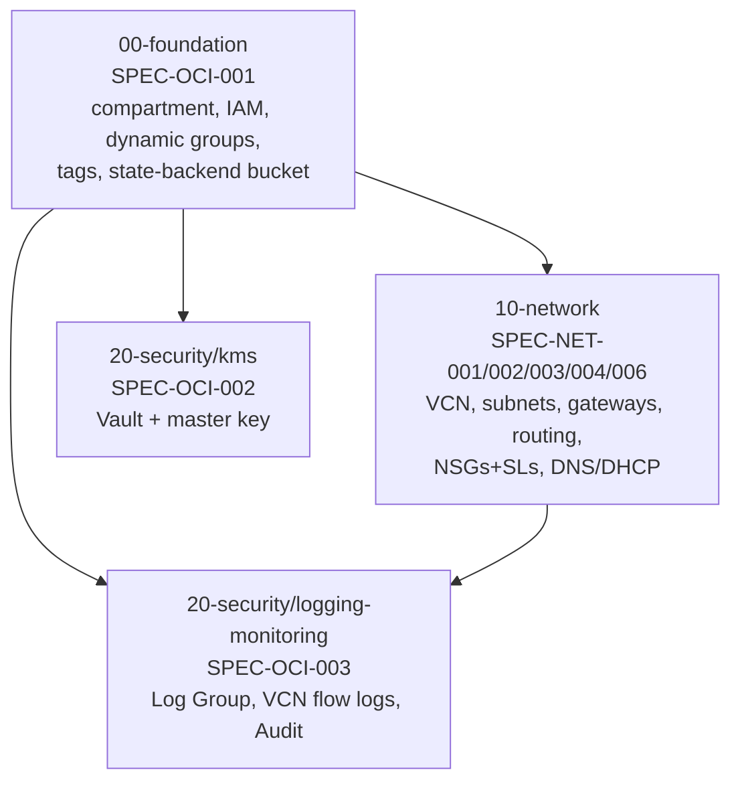

# Infrastructure

Status: **design stage** — this document defines the conventions,
traceability, and state architecture that every module/live unit under
this directory must follow. No OCI resources have been applied yet. See
[docs/01-architecture/foundation.md](../docs/01-architecture/foundation.md)
for the as-built compartment/IAM/state-backend documentation once
`SPEC-OCI-001` is actually implemented — per
[docs/01-architecture/README.md](../docs/01-architecture/README.md#diagrams-to-be-added-as-their-owning-spec-ships),
that file is added by the PR that implements it, not before. This
document is different: it is IaC tooling/convention documentation for the
`infrastructure/` directory itself, not an architecture view.

## Layout

```text
infrastructure/
├── modules/        OpenTofu modules — resource logic, environment-neutral
│   └── README.md    the module contract standard every module follows
├── compositions/    (reserved — wiring multiple modules together, if a
│                     unit ever needs more than one module; empty for M1)
└── live/            Terragrunt — environment composition, state, DAG
    ├── root.hcl
    ├── common/       shared account/tags/version configuration
    └── oci/eu-madrid-1/lab/   the only environment that exists so far
```

## Toolchain (verified against authoritative sources, not memory)

| Tool | Version | Source checked |
| --- | --- | --- |
| OpenTofu | v1.12.5 | [opentofu/opentofu releases](https://github.com/opentofu/opentofu/releases/latest) — matches local install |
| Terragrunt | v1.1.3 | [gruntwork-io/terragrunt releases](https://github.com/gruntwork-io/terragrunt/releases/latest) — matches local install |
| `oracle/oci` provider | v8.27.0 | [oracle/terraform-provider-oci releases](https://github.com/oracle/terraform-provider-oci/releases/latest) |
| `tflint-ruleset-terraform` | v0.15.0 | [terraform-linters/tflint-ruleset-terraform releases](https://github.com/terraform-linters/tflint-ruleset-terraform/releases/latest) — was unpinned in `.tflint.hcl`, fixed by this change |
| checkov | via `bridgecrewio/checkov-action` (already pinned in `validate.yml`) | manages its own checkov version |

`validate.yml` pins `tofu_version: "1.x"` (floating minor) via
`opentofu/setup-opentofu` — intentional, matches that workflow's existing
convention rather than hard-pinning a patch version CI would need
updating for every OpenTofu release.

## Requirement-to-resource traceability matrix

Every module below is planned, not yet built. This matrix is the
contract each future PR's module must satisfy — no resource may be added
without a row here tracing it to a requirement.

| Spec | Requirements | ARCH ID(s) | Threat-model corpus ref | Module | State unit |
| --- | --- | --- | --- | --- | --- |
| SPEC-OCI-001 | REQ-OCI-001..007 | `ARCH-GOV-TENANCY` | `ARCH-OCI-TENANCY`/`ARCH-OCI-COMPARTMENT` scopes (`network.yaml`) | `modules/foundation` | `00-foundation` |
| SPEC-NET-001 | REQ-NET-001..005 | `ARCH-NET-VCN`, `ARCH-ZONE-*` | `network.yaml` trust_zones (4, already schema-validated) | `modules/network` | `10-network` |
| SPEC-NET-002 | REQ-NET-006..010 | `ARCH-GW-IGW/NAT/SGW/DRG` | `network.yaml` components `COMP-INTERNET-GATEWAY`/`COMP-NAT-GATEWAY`/`COMP-SERVICE-GATEWAY` | `modules/network` | `10-network` |
| SPEC-NET-003 | REQ-NET-011..015 | `ARCH-FLOW-INGRESS/EGRESS/SERVICE` | `network.yaml` `FLOW-*` (transport/authz already modeled) | `modules/network` | `10-network` |
| SPEC-NET-004 | REQ-NET-016..020 | `ARCH-ZONE-MGMT`, NSGs | `network.yaml` `POLICY-CONTROL-NSG-6443`, `CTRL-K8S-API-INGRESS-RESTRICTION`, `COMP-*-NSG` (5) | `modules/network` | `10-network` |
| SPEC-NET-006 | REQ-NET-028..030 | `ARCH-NET-DNS` | not yet in `network.yaml` — DNS/DHCP wasn't part of the network-domain PoC migration | `modules/network` | `10-network` |
| SPEC-NET-005 | REQ-NET-021..027 | all `ARCH-FLOW-*` | verification layer — **no module, no state unit** (ADR-0007) | n/a (`tofu test` cross-module assertions) | n/a |
| SPEC-OCI-002 | REQ-OCI-008..011 | `ARCH-SVC-KMS` | not yet in `network.yaml` (identity/governance domain, not populated) | `modules/kms` | `20-security/kms` |
| SPEC-OCI-003 | REQ-OCI-012..015 | `ARCH-SVC-LOGGING`, `ARCH-SVC-MONITORING` | not yet in `network.yaml` | `modules/logging-monitoring` | `20-security/logging-monitoring` |

Module names above (`foundation`, `network`, `kms`, `logging-monitoring`)
are **not** this PR's invention — each is already fixed by its Spec's own
Constraints section (SPEC-OCI-001/GitHub Issue #11: `modules/foundation`;
SPEC-NET-001/004: `modules/network`; SPEC-OCI-002: `modules/kms`;
SPEC-OCI-003: `modules/logging-monitoring`). An earlier draft of this
table proposed an `oci-*`-prefixed naming scheme before checking the
Specs' own Constraints sections against it — corrected once that check
was actually done (per the master execution prompt's "do not accept
names blindly" instruction, which cuts both ways: don't blindly accept
*or* blindly invent).

Threat-model corpus gaps this matrix surfaces (real findings, not
invented): `network.yaml` doesn't yet model DNS/DHCP (SPEC-NET-006) or
anything from the OCI-foundation/KMS/logging domains — those live in
domains (`identity`, `governance`) not yet populated per the threat-model
corpus's own explicit review gate (still pending your sign-off before
scaling past `network.yaml`). This is not blocking for M1 IaC work — the
Specs themselves are the requirement source — but the corpus won't have
full M1 coverage until those domains are populated.

## State DAG

Fully decided by
[ADR-0007](../docs/02-decisions/ADR-0007-terragrunt-state-boundaries.md) —
this section operationalizes that decision, it does not re-derive it.



4 units for M1 (not ~15 — ADR-0007 rejected fine-grained splitting; not 1
— ADR-0007 rejected monolithic). `40-storage` (I19/M9) and `90-hybrid`
(possible future DRG split, I21) are explicitly deferred by that ADR —
not created now. `SPEC-NET-005` (traffic-flow invariants) has no state
unit — it's a `tofu test` verification layer over `10-network`'s applied
outputs, not a provisioner.

Bootstrap order is strict: `00-foundation` first (self-bootstrapping, see
below), then `10-network` and `20-security/kms` in either order, then
`20-security/logging-monitoring` last (needs both `00-foundation` and
`10-network`).

## Remote-state bootstrap sequence (REQ-OCI-007)

The chicken-and-egg problem: the OCI Object Storage bucket that will hold
every unit's remote state cannot itself be backed by that same remote
state on its first `apply` — the bucket doesn't exist yet.

```text
1. LOCAL BOOTSTRAP APPLY
   cd live/oci/eu-madrid-1/lab/00-foundation
   terragrunt apply -state=bootstrap.local.tfstate
   -> creates: platform compartment, IAM policies/dynamic groups,
      defined tags, the state bucket itself (versioned, encrypted,
      not public — Checkov-enforced, soft_fail: false)

2. MIGRATE STATE
   terragrunt init -migrate-state
   -> moves 00-foundation's own state from bootstrap.local.tfstate
      into the bucket it just created

3. VERIFY REMOTE BACKEND
   test ! -f terraform.tfstate && test ! -f bootstrap.local.tfstate
   oci os object list --bucket-name "$STATE_BUCKET" --namespace "$OCI_NS" \
     --query "data[?starts_with(name, 'foundation/')]"

4. REMOVE BOOTSTRAP DEPENDENCY
   bootstrap.local.tfstate MUST be deleted immediately after step 3
   succeeds (SPEC-OCI-001's Failure Modes: "a second bootstrap run
   would silently diverge from the real remote state" if retained)

5. EVERY SUBSEQUENT UNIT (10-network, 20-security/*)
   uses the remote backend from its first apply — no bootstrap needed,
   00-foundation's bucket already exists
```

This is a **one-time, explicitly-labeled operation per environment**, not
a repeatable CI step — `plan.yml`/`validate.yml` never run it. Backend:
OCI Object Storage (native OpenTofu S3-compatible backend against OCI's
S3-compatibility API, per REQ-OCI-005 — versioning enabled, no third-party
state SaaS).

**Locking (resolved, PR B)**: checked against OCI's own S3 Compatibility
API reference, which explicitly enumerates supported `PutObject` request
headers — only encryption and chunked-upload headers are listed;
`If-None-Match`/`If-Match` are conspicuously absent, unlike AWS S3's own
reference. `use_lockfile` is left **disabled** in `live/root.hcl` rather
than trust unverified conditional-write support. Concurrency control is
process-level instead: never run `terragrunt apply` concurrently against
the same unit (single-maintainer repo; CI never auto-applies). See
`live/root.hcl`'s own LOCKING NOTE comment for the full
[Cause]→[Impact]→[Remediation].

## Secrets and credentials strategy

`plan.yml` already uses static long-lived OCI API key credentials via
GitHub Actions encrypted secrets (`OCI_TENANCY_OCID`, `OCI_USER_OCID`,
`OCI_FINGERPRINT`, `OCI_REGION`, `OCI_PRIVATE_KEY`) — matching
`SPEC-OCI-001`'s explicit, in-scope decision (REQ-OCI-006): "static keys
are in scope for this Spec; OIDC is a follow-on" (EPIC-OCI-04).

Verified: OCI IAM Workload Identity Federation (WIF) — GitHub Actions
OIDC → OCI federated, short-lived credentials — exists and is currently
supported by OCI (not historical/deprecated). This is **not** adopted now:
`SPEC-OCI-001`'s Non-Goals explicitly defer it, and this document respects
that Spec's own scope decision rather than silently "upgrading" it ahead
of the Spec that owns the decision. Recorded here as a confirmed-available
follow-on for EPIC-OCI-04, not a gap.

Local development authentication strategy (OCI CLI config / API key
profile vs. session token) is not yet decided — tracked as an open item
for whichever PR first needs a human to run `tofu`/`terragrunt` locally
against real OCI (likely `00-foundation`'s own PR, since REQ-OCI-007's
bootstrap is inherently a local/manual one-time step, not a CI step).

## Tagging contract

Defined Tags namespace `platform`, applied to every resource under the
platform compartment (REQ-OCI-004 requires `platform`/`environment` at
minimum). Extending the master execution prompt's proposed dimensions to
what this repo can actually populate without inventing governance
decisions:

| Tag | Values (M1) | Source |
| --- | --- | --- |
| `Platform.Environment` | `lab` (only environment that exists) | `common/tags.hcl` / `env.hcl` |
| `Platform.System` | `oracle-free-tier-platform` | `common/tags.hcl` |
| `Platform.ManagedBy` | `opentofu` | `common/tags.hcl` |
| `Security.TrustZone` | `edge`\|`management`\|`workload`\|`data`\|`n/a` (foundation-level resources) | per-resource, set in each module |

`Platform.Component`, `Platform.Cluster`, `Platform.Owner`,
`Security.Exposure`, `Security.DataClassification`, `Security.Criticality`,
`Operations.Backup`, `Operations.DR`, `Operations.Monitoring`,
`Operations.Lifecycle` from the master execution prompt's proposed list
are **not** included yet — each requires a governance decision (who is
"Owner"? what's the DR policy?) this repo hasn't made. Per that prompt's
own rule ("do not invent values that require governance decisions"),
these are deferred, not silently populated with a placeholder. `Platform.Cluster`
specifically has no value yet because no Kubernetes cluster exists
(M2+).

## IAM bootstrap model

Four identity classes, kept explicitly distinct (never collapsed into one
broad grant):

1. **Bootstrap identity** — whoever runs `00-foundation`'s two-phase
   REQ-OCI-007 sequence for the first time in a new environment. Needs
   compartment-create, IAM-policy-manage, and Object-Storage-bucket-create
   rights at (necessarily, since the compartment doesn't exist yet)
   tenancy scope for that one bootstrap operation only.
2. **CI/workflow identity** — `plan.yml`'s static credentials today. Needs
   read/plan-equivalent rights (list/get) across the platform compartment
   for every resource type M1 touches, scoped to that compartment, never
   tenancy-wide (REQ-OCI-002). Apply rights are a **separate, narrower**
   grant than plan/read — the CI identity that plans should not
   automatically also be authorized to apply (matches the master execution
   prompt's IAM Summary requirement: "who will perform the apply and with
   what permissions" must be answered explicitly, not implied).
3. **Human administrator** — the repo owner, running `terragrunt apply`
   locally for the authorized-apply step (per the hard stop this phase
   respects) until CI-driven apply is explicitly designed and approved —
   not assumed here.
4. **Future instance/resource principals** — REQ-OCI-003's Dynamic Groups,
   matching Talos/Flux-managed instances once they exist (M2+). Not needed
   for M1's own apply, but the Dynamic Group match-rule *shape* is part of
   `00-foundation`'s scope (REQ-OCI-003) since it's compartment/IAM
   plumbing, even though nothing consumes it until compute exists.

Exact least-privilege policy statements now exist —
`modules/foundation/iam.tf` (CI and admin `oci_identity_policy` resources,
verified compartment-scoped, no `in tenancy` statement — enforced by
`tests/foundation.tftest.hcl`). What's still **not** resolved here: the
bootstrap identity's own tenancy-level grant (item 1 above) — that's
inherently outside any `tofu apply` this repo runs (chicken-and-egg: a
compartment-scoped policy can't authorize its own compartment's
creation) — see `modules/foundation/README.md#bootstrap-identity-requirement-not-granted-by-this-module`.

## Free Tier classification (M1 scope)

Verified against
[OCI Always Free documentation](https://docs.oracle.com/en-us/iaas/Content/FreeTier/freetier_topic-Always_Free_Resources.htm),
not historical assumption:

| Resource | Classification | Evidence |
| --- | --- | --- |
| Compartment, IAM policies, Dynamic Groups | FREE | no cost dimension exists for these resource types |
| VCN (1, of 2 allowed) | FREE | Always Free tenancies get up to 2 VCNs |
| Subnets, route tables | FREE | no per-resource cost; not separately metered |
| Internet Gateway, NAT Gateway, Service Gateway | FREE | not listed as chargeable; **egress volume** counts against the 10 TB/month allowance (a usage dimension, not a per-gateway charge) |
| DRG (attached, inert) | FREE | attachment itself carries no direct cost (confirmed by ADR-0008's own research) |
| NSGs, Security Lists | FREE | no cost dimension |
| OCI Vault, type `DEFAULT` | FREE | software-protected master-key versions are explicitly "all free"; **`VIRTUAL_PRIVATE` vaults are NOT free** — REQ-OCI-008's `DEFAULT`-only requirement is the guardrail that keeps this FREE |
| Object Storage (state bucket) | FREE, bounded | 20 GB combined Always-Free allowance; a Terraform/Terragrunt state bucket is KB-scale, nowhere near the limit |
| OCI Logging (Log Group + VCN flow logs) | FREE, bounded | 10 GB/month ingestion allowance on Always-Free tenancies |
| OCI Monitoring | FREE, bounded | 500M ingestion + 1B retrieval data points/month allowance |
| OCI Audit | FREE | tenancy-native, always-on, no separate charge |

**No PAID or UNKNOWN resource is proposed for M1.** Nothing here blocks
progression to a plan/apply gate on Free Tier grounds. This table should
be re-verified against current OCI documentation before the actual first
apply, not assumed to still hold indefinitely.

## Module contract standard

See [modules/README.md](modules/README.md) for the full contract every
OpenTofu module must satisfy (purpose, input/output contract, security
invariants, validation, tests, examples). `modules/foundation/` (PR B) is
the first module built against it — compartment, tags, IAM, state
bucket, 11 `tofu test` assertions (6 positive, 5 negative), all passing
against the real `oracle/oci` v8.27.0 provider schema.

## Terragrunt live layout

See `live/` for the account/region/environment composition layer
(`root.hcl`, `common/*.hcl`, `oci/eu-madrid-1/region.hcl`,
`oci/eu-madrid-1/lab/env.hcl`) plus the first real unit,
`oci/eu-madrid-1/lab/00-foundation/terragrunt.hcl` (PR B), wired to
`modules/foundation`. Verified end-to-end with `terragrunt render`
(includes resolve, `inputs` merge correctly, `generate` blocks produce
valid provider/backend HCL) — not just `hcl fmt`/`hcl validate` syntax
checks. `10-network`/`20-security/*` units still don't exist — each is
added alongside its own module, so no `terragrunt.hcl` ever points at a
`terraform { source = ... }` that doesn't exist.

## CI pipeline — current state and known gap

`validate.yml` (fmt/validate/`tofu test`/tflint/checkov) and `plan.yml`
(plan against `infrastructure/live/oci/eu-madrid-1/lab`, static secrets,
skips cleanly if unconfigured) already exist and match this document's
toolchain.

**Fixed by PR B**: `validate.yml`'s `tofu test` loop `cd`'d into the
`tests/` subdirectory itself (`find ... -printf '%h\n'` returns the
`.tftest.hcl` file's own directory) rather than the module root `tofu
test` needs to run from — a latent bug that only surfaced once real test
files existed. Also fixed: `modules/foundation` initially had no file
literally named `main.tf` (resources split by concern into
`compartment.tf`/`tags.tf`/`iam.tf`/`state_backend.tf`), so the
`validate modules` loop's `find -name main.tf` never discovered it —
added a real, non-empty navigational `main.tf` rather than change the
discovery pattern.

**Still a known gap, not fixed by this PR**: `plan.yml` currently runs a
single `tofu plan` directly against the `lab` environment root — once
`10-network`/`20-security/*` also have real `terragrunt.hcl` files, it
needs to become Terragrunt-DAG-aware (`terragrunt run-all plan` or a
per-unit loop in dependency order) so a PR touching `10-network` doesn't
silently skip planning `20-security/logging-monitoring`'s dependency on
it. Deferred to the PR that creates the second real unit — with only
`00-foundation` existing, there's no DAG yet to be unaware of.

## Apply gate

Not reached by this PR. `modules/foundation` exists, is `tofu
validate`/`tofu test`/`tflint`/`checkov`-clean, and its Terragrunt unit
(`00-foundation`) renders correctly — but no real OCI credentials are
configured in this environment, so no real `tofu plan` has ever been
generated against actual OCI. Per the master execution prompt's APPLY
GATE requirements, an ungenerated plan alone is sufficient to keep this
gate closed regardless of how clean static validation is. See the phase-4
PR B execution report for the current gate status and the full
[Cause]→[Impact]→[Remediation] on the S3-compat locking finding.
