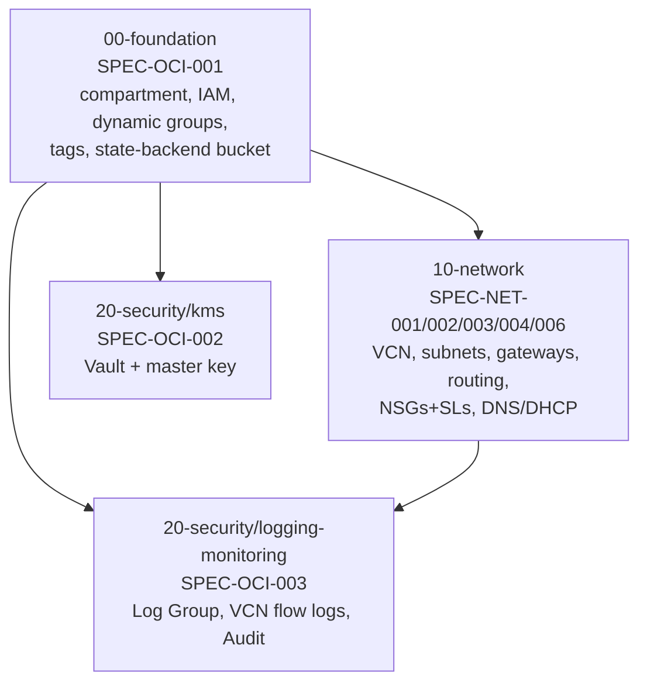

# Infrastructure

Status: **design stage** — this document defines the conventions,
traceability, and state architecture that every module/live unit under
this directory must follow. No OCI resources have been applied yet. See
[docs/01-architecture/foundation.md](../docs/01-architecture/foundation.md)
for the as-built compartment/IAM/state-backend documentation once
`SPEC-OCI-001` is actually implemented — per
[docs/01-architecture/README.md](../docs/01-architecture/README.md#diagrams-to-be-added-as-their-owning-spec-ships),
that file is added by the PR that implements it, not before. This
document is different: it is IaC tooling/convention documentation for the
`infrastructure/` directory itself, not an architecture view.

## Layout

```text
infrastructure/
├── modules/        OpenTofu modules — resource logic, environment-neutral
│   └── README.md    the module contract standard every module follows
├── compositions/    (reserved — wiring multiple modules together, if a
│                     unit ever needs more than one module; empty for M1)
└── live/            Terragrunt — environment composition, state, DAG
    ├── root.hcl
    ├── common/       shared account/tags/version configuration
    └── oci/eu-madrid-1/lab/   the only environment that exists so far
```

## Toolchain (verified against authoritative sources, not memory)

| Tool | Version | Source checked |
| --- | --- | --- |
| OpenTofu | v1.12.5 | [opentofu/opentofu releases](https://github.com/opentofu/opentofu/releases/latest) — matches local install |
| Terragrunt | v1.1.3 | [gruntwork-io/terragrunt releases](https://github.com/gruntwork-io/terragrunt/releases/latest) — matches local install |
| `oracle/oci` provider | v8.27.0 | [oracle/terraform-provider-oci releases](https://github.com/oracle/terraform-provider-oci/releases/latest) |
| `tflint-ruleset-terraform` | v0.15.0 | [terraform-linters/tflint-ruleset-terraform releases](https://github.com/terraform-linters/tflint-ruleset-terraform/releases/latest) — was unpinned in `.tflint.hcl`, fixed by this change |
| checkov | via `bridgecrewio/checkov-action` (already pinned in `validate.yml`) | manages its own checkov version |

`validate.yml` pins `tofu_version: "1.x"` (floating minor) via
`opentofu/setup-opentofu` — intentional, matches that workflow's existing
convention rather than hard-pinning a patch version CI would need
updating for every OpenTofu release.

## Requirement-to-resource traceability matrix

Every module below is planned, not yet built. This matrix is the
contract each future PR's module must satisfy — no resource may be added
without a row here tracing it to a requirement.

| Spec | Requirements | ARCH ID(s) | Threat-model corpus ref | Module | State unit |
| --- | --- | --- | --- | --- | --- |
| SPEC-OCI-001 | REQ-OCI-001..007 | `ARCH-GOV-TENANCY` | `ARCH-OCI-TENANCY`/`ARCH-OCI-COMPARTMENT` scopes (`network.yaml`) | `modules/foundation` | `00-foundation` |
| SPEC-NET-001 | REQ-NET-001..005 | `ARCH-NET-VCN`, `ARCH-ZONE-*` | `network.yaml` trust_zones (4, already schema-validated) | `modules/network` | `10-network` |
| SPEC-NET-002 | REQ-NET-006..010 | `ARCH-GW-IGW/NAT/SGW/DRG` | `network.yaml` components `COMP-INTERNET-GATEWAY`/`COMP-NAT-GATEWAY`/`COMP-SERVICE-GATEWAY` | `modules/network` | `10-network` |
| SPEC-NET-003 | REQ-NET-011..015 | `ARCH-FLOW-INGRESS/EGRESS/SERVICE` | `network.yaml` `FLOW-*` (transport/authz already modeled) | `modules/network` | `10-network` |
| SPEC-NET-004 | REQ-NET-016..020 | `ARCH-ZONE-MGMT`, NSGs | `network.yaml` `POLICY-CONTROL-NSG-6443`, `CTRL-K8S-API-INGRESS-RESTRICTION`, `COMP-*-NSG` (5) | `modules/network` | `10-network` |
| SPEC-NET-006 | REQ-NET-028..030 | `ARCH-NET-DNS` | not yet in `network.yaml` — DNS/DHCP wasn't part of the network-domain PoC migration | `modules/network` | `10-network` |
| SPEC-NET-005 | REQ-NET-021..027 | all `ARCH-FLOW-*` | verification layer — **no module, no state unit** (ADR-0007) | n/a (`tofu test` cross-module assertions) | n/a |
| SPEC-OCI-002 | REQ-OCI-008..011 | `ARCH-SVC-KMS` | not yet in `network.yaml` (identity/governance domain, not populated) | `modules/kms` | `20-security/kms` |
| SPEC-OCI-003 | REQ-OCI-012..015 | `ARCH-SVC-LOGGING`, `ARCH-SVC-MONITORING` | not yet in `network.yaml` | `modules/logging-monitoring` | `20-security/logging-monitoring` |

Module names above (`foundation`, `network`, `kms`, `logging-monitoring`)
are **not** this PR's invention — each is already fixed by its Spec's own
Constraints section (SPEC-OCI-001/GitHub Issue #11: `modules/foundation`;
SPEC-NET-001/004: `modules/network`; SPEC-OCI-002: `modules/kms`;
SPEC-OCI-003: `modules/logging-monitoring`). An earlier draft of this
table proposed an `oci-*`-prefixed naming scheme before checking the
Specs' own Constraints sections against it — corrected once that check
was actually done (per the master execution prompt's "do not accept
names blindly" instruction, which cuts both ways: don't blindly accept
*or* blindly invent).

Threat-model corpus gaps this matrix surfaces (real findings, not
invented): `network.yaml` doesn't yet model DNS/DHCP (SPEC-NET-006) or
anything from the OCI-foundation/KMS/logging domains — those live in
domains (`identity`, `governance`) not yet populated per the threat-model
corpus's own explicit review gate (still pending your sign-off before
scaling past `network.yaml`). This is not blocking for M1 IaC work — the
Specs themselves are the requirement source — but the corpus won't have
full M1 coverage until those domains are populated.

## State DAG

Fully decided by
[ADR-0007](../docs/02-decisions/ADR-0007-terragrunt-state-boundaries.md) —
this section operationalizes that decision, it does not re-derive it.



4 units for M1 (not ~15 — ADR-0007 rejected fine-grained splitting; not 1
— ADR-0007 rejected monolithic). `40-storage` (I19/M9) and `90-hybrid`
(possible future DRG split, I21) are explicitly deferred by that ADR —
not created now. `SPEC-NET-005` (traffic-flow invariants) has no state
unit — it's a `tofu test` verification layer over `10-network`'s applied
outputs, not a provisioner.

Bootstrap order is strict: `00-foundation` first (self-bootstrapping, see
below), then `10-network` and `20-security/kms` in either order, then
`20-security/logging-monitoring` last (needs both `00-foundation` and
`10-network`).

## Remote-state bootstrap sequence (REQ-OCI-007)

The chicken-and-egg problem: the OCI Object Storage bucket that will hold
every unit's remote state cannot itself be backed by that same remote
state on its first `apply` — the bucket doesn't exist yet.

```text
1. LOCAL BOOTSTRAP APPLY (untracked scratch copy, NOT the module or the
   Terragrunt unit in place)
   cp -r modules/foundation /tmp/foundation-bootstrap && cd /tmp/foundation-bootstrap
   tofu init -input=false && tofu apply -input=false
   -> creates: platform compartment, IAM policies/dynamic groups,
      defined tags, the state bucket itself (versioned, encrypted,
      not public — Checkov-enforced, soft_fail: false)

2. WRITE A REAL backend.tf AND MIGRATE (same scratch copy)
   cat > backend.tf <<EOF ... EOF   # full config, not -backend-config flags
   tofu init -input=false -migrate-state
   -> moves the scratch copy's local terraform.tfstate into the bucket
      it just created, at the exact key Terragrunt's own unit will use

3. VERIFY REMOTE BACKEND
   test ! -f terraform.tfstate
   oci os object list --bucket-name "$STATE_BUCKET" --namespace "$OCI_NS" \
     --query "data[?starts_with(name, 'oci/eu-madrid-1/lab/00-foundation/')]"

4. DISCARD THE SCRATCH COPY
   rm -rf /tmp/foundation-bootstrap
   -> nothing here was ever tracked in git; no repo cleanup needed

5. EVERY SUBSEQUENT UNIT (10-network, 20-security/*, and 00-foundation's
   OWN Terragrunt unit from now on)
   uses the remote backend from its first `terragrunt` run — no bootstrap
   needed, the bucket already exists
```

**Why a scratch copy, not the module or Terragrunt unit in place**: the
module deliberately declares no backend block (Terragrunt's `generate`
mechanism owns that once a unit exists — see `live/root.hcl`). Bootstrap
needs to write ITS OWN temporary `backend.tf` to reach the bucket before
it exists at all — writing that into the tracked module source would
leave a second, permanent backend declaration behind that conflicts with
Terragrunt's generated one on every subsequent run (`OpenTofu` rejects
two backend blocks in one configuration outright — confirmed by
reproducing it locally, not assumed). The scratch copy is discarded
specifically so that conflict never has anywhere to persist. Full
runbook: `modules/foundation/README.md#bootstrap-runbook`.

This is a **one-time, explicitly-labeled operation per environment**, not
a repeatable CI step — `plan.yml`/`validate.yml` never run it. Backend:
OCI Object Storage (native OpenTofu S3-compatible backend against OCI's
S3-compatibility API, per REQ-OCI-005 — versioning enabled, no third-party
state SaaS).

**Locking (resolved, PR B)**: checked against OCI's own S3 Compatibility
API reference, which explicitly enumerates supported `PutObject` request
headers — only encryption and chunked-upload headers are listed;
`If-None-Match`/`If-Match` are conspicuously absent, unlike AWS S3's own
reference. `use_lockfile` is left **disabled** in `live/root.hcl` rather
than trust unverified conditional-write support. Concurrency control is
process-level instead: never run `terragrunt apply` concurrently against
the same unit (single-maintainer repo; CI never auto-applies). See
`live/root.hcl`'s own LOCKING NOTE comment for the full
[Cause]→[Impact]→[Remediation].

## Secrets and credentials strategy

`plan.yml` already uses static long-lived OCI API key credentials via
GitHub Actions encrypted secrets (`OCI_TENANCY_OCID`, `OCI_USER_OCID`,
`OCI_FINGERPRINT`, `OCI_REGION`, `OCI_PRIVATE_KEY`) — matching
`SPEC-OCI-001`'s explicit, in-scope decision (REQ-OCI-006): "static keys
are in scope for this Spec; OIDC is a follow-on" (EPIC-OCI-04).

Verified: OCI IAM Workload Identity Federation (WIF) — GitHub Actions
OIDC → OCI federated, short-lived credentials — exists and is currently
supported by OCI (not historical/deprecated). This is **not** adopted now:
`SPEC-OCI-001`'s Non-Goals explicitly defer it, and this document respects
that Spec's own scope decision rather than silently "upgrading" it ahead
of the Spec that owns the decision. Recorded here as a confirmed-available
follow-on for EPIC-OCI-04, not a gap.

### Local development: credential architecture

Two distinct credential types, kept explicitly separate, matching the
CREDENTIAL SCOPE NOTE in `live/root.hcl`:

- **Native OCI API** (the `oci` CLI, the `oracle/oci` provider) — reads
  `~/.oci/config` (tenancy/user OCID, fingerprint, region, API private
  key) directly. No repository-owned tooling involved; this is the OCI
  CLI's own standard config file.
- **OCI Object Storage's S3 Compatibility API** (the OpenTofu `s3`
  backend used for remote state) — requires an OCI Customer Secret Key,
  exposed to the AWS-SDK-shaped S3 client as `AWS_ACCESS_KEY_ID`/
  `AWS_SECRET_ACCESS_KEY`. **These are S3-client-mandated variable
  names, not AWS account credentials** — OpenTofu's `s3` backend is
  simply an S3-protocol client, and OCI Object Storage's Amazon S3
  Compatibility API happens to authenticate with that same variable
  pair. See `live/root.hcl`'s CREDENTIAL SCOPE NOTE for how the backend
  is also made to fail closed against any local `~/.aws/credentials` or
  cached AWS SSO session, independent of the wrapper below.

```text
Proton Pass (vault "Personal", item "OCI - OpenTofu Remote State v3")
    -> pass-cli run
    -> AWS_ACCESS_KEY_ID / AWS_SECRET_ACCESS_KEY
       (this process's environment only -- never persisted)
    -> OpenTofu S3-compatible backend
    -> OCI Object Storage
```

Rather than requiring `export AWS_ACCESS_KEY_ID=... AWS_SECRET_ACCESS_KEY=...`
by hand every session, `live/scripts/tg` wraps `terragrunt` for local
runs: `resolve_backend_credentials_proton_pass()` resolves the Customer
Secret Key pair from Proton Pass into `pass://` *references* (never raw
values — see the script's own "Why references, not values" comment),
and `run_with_backend_credentials()` hands those to `pass-cli run`,
which resolves them itself and injects real values only into the
`terragrunt` child process — `tg`'s own process never holds, reads,
prints, logs, or disk-stages either value. It also auto-resolves the
non-secret Object Storage namespace live via `oci os ns get` (native OCI
auth, already configured) instead of requiring a separately-exported
`OCI_OBJECT_STORAGE_NAMESPACE`, and fails closed with a clear error if
Proton Pass can't supply the Customer Secret Key. These two functions
are a deliberate provider boundary: swapping to a future OpenBao
provider means replacing `resolve_backend_credentials_proton_pass()`
alone — see "Secret-source migration path" below. See
`live/scripts/tg.test.sh` for the wrapper's own deterministic (stubbed,
no real Proton Pass/OCI access) test coverage, including a
provider-boundary separation check.

#### Credential precedence

Fixed, no override, no exceptions:

1. **Proton Pass** (via `tg`) — the only supported source for
   interactive/local use. There is deliberately no "already set in the
   environment" step — `tg` overwrites any pre-existing
   `AWS_ACCESS_KEY_ID`/`AWS_SECRET_ACCESS_KEY` for the child process
   rather than honoring them, since honoring a pre-set value is exactly
   the manual-export bypass this wrapper exists to prevent.
   `~/.aws/credentials`, `~/.aws/config`, `AWS_PROFILE`,
   `AWS_DEFAULT_PROFILE`, AWS SSO, EC2/ECS metadata, and macOS Keychain
   are never consulted at any point in this precedence.
2. **Fail closed.**

**BREAK GLASS / CI INTERFACE** (not the local operator workflow): CI's
`plan.yml` supplies `AWS_ACCESS_KEY_ID`/`AWS_SECRET_ACCESS_KEY` directly
as GitHub Actions secrets to `gruntwork-io/terragrunt-action`, bypassing
`tg` entirely — that is CI's own documented, narrowly-scoped interface.
A human or agent must never replicate this locally by exporting these
variables by hand; always go through `tg`.

#### Prerequisites

- `oci` CLI installed and authenticated (`~/.oci/config` populated —
  native OCI API auth, unrelated to the backend credential below).
- `pass-cli` installed and authenticated (`pass-cli login`, interactive,
  opens a browser — `tg` never attempts this for you; verify with
  `pass-cli info`).
- A Proton Pass Login item named `OCI - OpenTofu Remote State v3` in the
  `Personal` vault, with `username` set to the OCI Customer Secret Key's
  Access Key ID and `password` set to its Secret Key. (The item *title*
  is configuration, safe to document — the field *values* are not, and
  never appear anywhere in this repository.)
- `tofu` and `terragrunt`, pinned versions per the Toolchain table above.

**Naming note**: the item title is versioned (`...v3`) because the
underlying OCI Customer Secret Key is versioned
(`platform-tfstate-backend-v3`) — a prior `OCI - OpenTofu Remote State
v2` item also exists in the same vault from an earlier iteration.
**Recommendation** (not yet applied): rename the *current* item to a
stable, unversioned title (e.g. `OCI - OpenTofu Remote State`) so
`tg`'s `PASS_ITEM` constant never needs to change on a future key
rotation — the OCI key's own display name can stay versioned
independently, since that's just a label, not a lookup key `tg`
depends on. This is a rename recommendation only; it has not been
applied, since renaming a Proton Pass item is a real action with real
consequences (anything else referencing the old title by name would
break) that the vault owner should decide and perform, and `tg`'s
`PASS_ITEM` constant would need updating in lockstep with any rename.

#### Usage

Always invoke through the wrapper — never export the backend credential
pair by hand:

```bash
infrastructure/live/scripts/tg init
infrastructure/live/scripts/tg plan
infrastructure/live/scripts/tg state list
```

Run from inside the target unit directory (e.g.
`infrastructure/live/oci/eu-madrid-1/lab/10-network`), matching plain
`terragrunt`'s own convention — `tg` forwards every argument unchanged.

#### Safe verification (never displays the credential)

```bash
pass-cli info                                     # confirms Proton Pass session, no secret output
pass-cli item view --vault-name "Personal" \
  --item-title "OCI - OpenTofu Remote State v3" \
  --output json | jq '.item.content | keys'        # confirms fields exist, prints only field NAMES
oci os ns get                                      # confirms native OCI auth + namespace, non-secret
```

Never run `pass-cli item view` for this item with `--output human` or
without piping into a values-stripping filter — both surface the raw
secret values.

#### Troubleshooting

| Symptom | Cause | Fix |
| --- | --- | --- |
| `pass-cli is not installed or not on PATH` | `pass-cli` missing | install it, then re-run `tg` |
| `pass-cli is not authenticated` | no active Proton Pass session | `pass-cli login` (interactive), retry |
| `Could not find item with name ...` | item missing/renamed/wrong vault | confirm vault `Personal`, item title exactly `OCI - OpenTofu Remote State v3` |
| `Field 'username'/'password' not found in item` | item exists but field missing | add the missing field in Proton Pass; never via a command that puts the value in shell history |
| `oci os ns get` fails / `~/.oci/config` errors | native OCI auth misconfigured | fix `~/.oci/config`, verify with `oci iam region list` |
| namespace resolution returns empty | transient OCI API issue, or wrong region in `~/.oci/config` | re-run; verify region matches `common/region.hcl` |
| backend authentication failure (`SignatureDoesNotMatch` etc.) | resolved credential pair doesn't match an ACTIVE OCI Customer Secret Key | confirm the Proton Pass item's values match a currently ACTIVE key (`oci iam customer-secret-key list --user-id <ocid>` — lists names/state only, never secret values) |
| `SignatureDoesNotMatch` immediately after creating a **new** Customer Secret Key | IAM→Object-Storage-compat credential propagation lag — confirmed transient during this bootstrap, several minutes, not a config defect (see "Bootstrap runbook" below) | retry after a few minutes; not a Proton Pass or `tg` problem |

#### Rotation procedure (high level)

1. Create a new OCI Customer Secret Key (`oci iam customer-secret-key
   create`) — do this alongside the existing one, don't delete the old
   key first.
2. Store the new Access Key ID / Secret Key pair in a **new** Proton
   Pass item (or update the existing item's fields) — never as a CLI
   literal argument if it can be avoided; if it can't, that's a real,
   narrow exposure window (briefly visible in `ps aux`) worth flagging
   before doing it.
3. Point `tg` at the new item (update `PASS_ITEM` in
   `infrastructure/live/scripts/tg` if the item title changed) and
   validate: `tg init`, `tg state list` against a real unit.
4. Verify remote state is reachable and a real plan succeeds before
   relying on the new key for anything else.
5. Retain the old key as a rollback path until the new one is proven in
   practice across a real init/plan/apply cycle.
6. Delete the old OCI Customer Secret Key only after explicit user
   approval — never as part of routine validation or automated cleanup.

#### Secret-source migration path

Proton Pass is a **bootstrap/local-development mechanism**, not this
platform's final-state secret architecture:

```text
Bootstrap (current):
  Proton Pass -> pass-cli -> tg -> Terragrunt/OpenTofu

Target (once OpenBao + External Secrets Operator -- already the
roadmap target, docs/00-overview/roadmap.md -- is deployed and
reachable from wherever Terragrunt/OpenTofu runs):
  OpenBao -> authenticated operator/automation identity ->
  policy-controlled backend-credential retrieval -> tg / automation

Future (where OCI/OpenTofu support it):
  OIDC / short-lived workload identity, eliminating static backend
  credentials entirely -- OpenBao then manages only whatever static or
  rotatable secrets still need to exist.
```

`tg`'s `run_with_backend_credentials()` function is the sole place that
knows how credentials are fetched (see the script's own header) — a
future migration to OpenBao replaces that one function's body; the
Terragrunt/OpenTofu-facing contract (`AWS_ACCESS_KEY_ID`/
`AWS_SECRET_ACCESS_KEY` as process-scoped environment variables) does
not change. This is a **temporary bootstrap decision**, not a
superseding architecture decision — it does not amend or replace the
OpenBao target already implied by the roadmap, and no new permanent
dependency on Proton Pass should be introduced beyond this bootstrap
role. A future ADR may formalize the OCI Vault-vs-OpenBao question for
in-cluster/workload secrets generally (see `SPEC-OCI-002`'s own note on
this); this bootstrap tooling choice is deliberately not that ADR.

## Tagging contract

Defined Tags namespace `platform`, applied to every resource under the
platform compartment (REQ-OCI-004 requires `platform`/`environment` at
minimum). Extending the master execution prompt's proposed dimensions to
what this repo can actually populate without inventing governance
decisions:

| Tag | Values (M1) | Source |
| --- | --- | --- |
| `Platform.Environment` | `lab` (only environment that exists) | `common/tags.hcl` / `env.hcl` |
| `Platform.System` | `oracle-free-tier-platform` | `common/tags.hcl` |
| `Platform.ManagedBy` | `opentofu` | `common/tags.hcl` |
| `Security.TrustZone` | `edge`\|`management`\|`workload`\|`data`\|`n/a` (foundation-level resources) | per-resource, set in each module |

`Platform.Component`, `Platform.Cluster`, `Platform.Owner`,
`Security.Exposure`, `Security.DataClassification`, `Security.Criticality`,
`Operations.Backup`, `Operations.DR`, `Operations.Monitoring`,
`Operations.Lifecycle` from the master execution prompt's proposed list
are **not** included yet — each requires a governance decision (who is
"Owner"? what's the DR policy?) this repo hasn't made. Per that prompt's
own rule ("do not invent values that require governance decisions"),
these are deferred, not silently populated with a placeholder. `Platform.Cluster`
specifically has no value yet because no Kubernetes cluster exists
(M2+).

## IAM bootstrap model

Four identity classes, kept explicitly distinct (never collapsed into one
broad grant):

1. **Bootstrap identity** — whoever runs `00-foundation`'s two-phase
   REQ-OCI-007 sequence for the first time in a new environment. Needs
   compartment-create, IAM-policy-manage, and Object-Storage-bucket-create
   rights at (necessarily, since the compartment doesn't exist yet)
   tenancy scope for that one bootstrap operation only.
2. **CI/workflow identity** — `plan.yml`'s static credentials today. Needs
   read/plan-equivalent rights (list/get) across the platform compartment
   for every resource type M1 touches, scoped to that compartment, never
   tenancy-wide (REQ-OCI-002). Apply rights are a **separate, narrower**
   grant than plan/read — the CI identity that plans should not
   automatically also be authorized to apply (matches the master execution
   prompt's IAM Summary requirement: "who will perform the apply and with
   what permissions" must be answered explicitly, not implied).
3. **Human administrator** — the repo owner, running `terragrunt apply`
   locally for the authorized-apply step (per the hard stop this phase
   respects) until CI-driven apply is explicitly designed and approved —
   not assumed here.
4. **Future instance/resource principals** — REQ-OCI-003's Dynamic Groups,
   matching Talos/Flux-managed instances once they exist (M2+). Not needed
   for M1's own apply, but the Dynamic Group match-rule *shape* is part of
   `00-foundation`'s scope (REQ-OCI-003) since it's compartment/IAM
   plumbing, even though nothing consumes it until compute exists.

Exact least-privilege policy statements now exist —
`modules/foundation/iam.tf` (CI and admin `oci_identity_policy` resources,
verified compartment-scoped, no `in tenancy` statement — enforced by
`tests/foundation.tftest.hcl`). What's still **not** resolved here: the
bootstrap identity's own tenancy-level grant (item 1 above) — that's
inherently outside any `tofu apply` this repo runs (chicken-and-egg: a
compartment-scoped policy can't authorize its own compartment's
creation) — see `modules/foundation/README.md#bootstrap-identity-requirement-not-granted-by-this-module`.

## Free Tier classification (M1 scope)

Verified against
[OCI Always Free documentation](https://docs.oracle.com/en-us/iaas/Content/FreeTier/freetier_topic-Always_Free_Resources.htm),
not historical assumption:

| Resource | Classification | Evidence |
| --- | --- | --- |
| Compartment, IAM policies, Dynamic Groups | FREE | no cost dimension exists for these resource types |
| VCN (1, of 2 allowed) | FREE | Always Free tenancies get up to 2 VCNs |
| Subnets, route tables | FREE | no per-resource cost; not separately metered |
| Internet Gateway, NAT Gateway, Service Gateway | FREE | not listed as chargeable; **egress volume** counts against the 10 TB/month allowance (a usage dimension, not a per-gateway charge) |
| DRG (attached, inert) | FREE | attachment itself carries no direct cost (confirmed by ADR-0008's own research) |
| NSGs, Security Lists | FREE | no cost dimension |
| OCI Vault, type `DEFAULT` | FREE | software-protected master-key versions are explicitly "all free"; **`VIRTUAL_PRIVATE` vaults are NOT free** — REQ-OCI-008's `DEFAULT`-only requirement is the guardrail that keeps this FREE |
| Object Storage (state bucket) | FREE, bounded | 20 GB combined Always-Free allowance; a Terraform/Terragrunt state bucket is KB-scale, nowhere near the limit |
| OCI Logging (Log Group + VCN flow logs) | FREE, bounded | 10 GB/month ingestion allowance on Always-Free tenancies |
| OCI Monitoring | FREE, bounded | 500M ingestion + 1B retrieval data points/month allowance |
| OCI Audit | FREE | tenancy-native, always-on, no separate charge |

**No PAID or UNKNOWN resource is proposed for M1.** Nothing here blocks
progression to a plan/apply gate on Free Tier grounds. This table should
be re-verified against current OCI documentation before the actual first
apply, not assumed to still hold indefinitely.

## Module contract standard

See [modules/README.md](modules/README.md) for the full contract every
OpenTofu module must satisfy (purpose, input/output contract, security
invariants, validation, tests, examples). `modules/foundation/` (PR B) is
the first module built against it — compartment, tags, IAM, state
bucket, 11 `tofu test` assertions (6 positive, 5 negative), all passing
against the real `oracle/oci` v8.27.0 provider schema.

## Terragrunt live layout

See `live/` for the account/region/environment composition layer
(`root.hcl`, `common/*.hcl`, `oci/eu-madrid-1/region.hcl`,
`oci/eu-madrid-1/lab/env.hcl`) plus the real units: `00-foundation` (PR
B), wired to `modules/foundation`, and `10-network` (PR C), wired to
`modules/network` via a Terragrunt `dependency` block consuming
`00-foundation`'s real `compartment_ocid` output (`mock_outputs` scoped
to `validate`/`plan`/`init` only, never `apply`). Both verified
end-to-end with `terragrunt render` (inputs resolve, `generate` blocks
produce valid provider/backend HCL) — not just `hcl fmt`/`hcl validate`
syntax checks — and both are now real, deployed, `0/0/0`-plan-verified
infrastructure; see "Apply gate" below. `20-security/*` units still
don't exist — added alongside their own modules, same pattern.

## CI pipeline — current state and known gap

`validate.yml` (fmt/validate/`tofu test`/tflint/checkov) and `plan.yml`
(plan against `infrastructure/live/oci/eu-madrid-1/lab`, static secrets,
skips cleanly if unconfigured) already exist and match this document's
toolchain.

**Fixed by PR B**: `validate.yml`'s `tofu test` loop `cd`'d into the
`tests/` subdirectory itself (`find ... -printf '%h\n'` returns the
`.tftest.hcl` file's own directory) rather than the module root `tofu
test` needs to run from — a latent bug that only surfaced once real test
files existed. Also fixed: `modules/foundation` initially had no file
literally named `main.tf` (resources split by concern into
`compartment.tf`/`tags.tf`/`iam.tf`/`state_backend.tf`), so the
`validate modules` loop's `find -name main.tf` never discovered it —
added a real, non-empty navigational `main.tf` rather than change the
discovery pattern.

**Fixed by PR B, confirmed still correct now that a real DAG exists (PR
C)**: `plan.yml` runs `terragrunt run-all plan` from the `lab`
environment root (`gruntwork-io/terragrunt-action`), not a single flat
`tofu plan` — it resolves the `00-foundation` → `10-network` dependency
order automatically. It still skips cleanly (not a false green) when
`OCI_TENANCY_OCID` isn't configured as a GitHub Actions secret, which
remains the case in this repo today.

## Apply gate — deployed evidence

Both `00-foundation` and `10-network` are real, deployed, independently
verified against the live tenancy — not just statically clean. This
section records what "deployed" means here, since GitHub Actions still
has no OCI credentials configured (`plan.yml` correctly skips there;
every apply below ran from a local operator session with real `~/.oci`
credentials and a Customer Secret Key for the S3-compat state backend).

**`00-foundation`** (PR B/#38, dynamic-group and IAM-policy deferral
fixes #39/#40, Oracle-Tags drift fix #41): 8 resources — platform
compartment, `Platform`/`Security` tag namespaces, 4 tag definitions, the
OpenTofu state bucket. Bootstrapped per REQ-OCI-007's two-phase sequence
against an untracked scratch copy, state migrated into
`oracle-free-tier-platform-tfstate`. Every resource independently
confirmed via `oci` CLI (not just `tofu state`). A real `tofu plan`
against the live tenancy returns `0 to add, 0 to change, 0 to destroy`.

**`10-network`** (PR C/#43): 5 resources — one VCN (`10.10.0.0/16`) and
four trust-zone subnets (Edge `10.10.10.0/24`, Management
`10.10.20.0/24`, Workload `10.10.30.0/24`, Data `10.10.40.0/24`), each
independently confirmed via `oci` CLI, including
`prohibit-public-ip-on-vnic` per zone (`false` for Edge, `true` for the
other three). `compartment_id` resolves through a real Terragrunt
`dependency` block to `00-foundation`'s actual output, confirmed by
inspecting the plan JSON directly rather than trusting the wiring. A real
`tofu plan` against the live tenancy returns `0 to add, 0 to change, 0 to
destroy`.

**S3-compat backend locking**: still `use_lockfile = false`
(unresolved conditional-write support, documented in `root.hcl`).
Confirmed in practice during this bootstrap: the backend also exhibited
transient `SignatureDoesNotMatch` failures for several minutes after each
new Customer Secret Key's creation (IAM→Object-Storage-compat credential
propagation lag, not a config defect — resolved on its own every time,
confirmed by reproducing the same failure/success pattern independently
via the AWS CLI). Single-writer discipline remains a hard requirement
until this is revisited.
